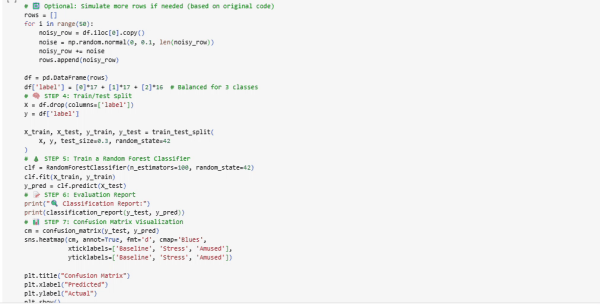

  <strong>
    <a href="index.md">🏠 Home</a> |
    <a href="#projects">💼 Projects</a> |
    <a href="resume.md">📄 Resume</a> |
    <a href="#contact">📬 Contact</a>
  </strong>

# 👩‍🔬 Reem Aboutaleb

**Google-Certified Data Analyst | Biomedical Engineering Master’s Student @ NYU**  
**Biology B.S. | Signal Processing | Machine Learning in Healthcare**

---

**A personal portfolio showcasing my work in biomedical engineering—where research, clinical insight, and machine learning intersect to solve real-world healthcare challenges through data-driven innovation.**

I hold a Bachelor’s in Biology and am currently pursuing my Master’s in Biomedical Engineering at NYU Tandon. I'm also certified in Google Data Analytics, with a strong foundation in Python, statistics, and biomedical data analysis. My focus is applying data science and signal processing to real-world healthcare challenges, from stress detection to smart diagnostic tools.

---

## 💼 Projects {#projects}

### 🧠 Multimodal Stress Detection  
Stress classification using physiological signals (PPG, EDA) and ML models.  
- **Tech**: Jupyter, Python, NeuroKit2, Scikit-learn  
🔗 [GitHub Repo](https://github.com/Reem-Aboutaleb/multimodal-stress-detection)  

---

### 💊 Drug Release Simulation  
Simulating drug release kinetics for first-order and zero-order models.  
- **Tech**: Python, Matplotlib, NumPy  
🔗 [GitHub Repo](https://github.com/Reem-Aboutaleb/Drug_Release_Simulation)

---

### 💓 ECG Signal Analysis  
Analyzing ECG signals and visualizing heart rate trends.  
- **Tech**: Python, Jupyter, Matplotlib  
🔗 [GitHub Repo](https://github.com/Reem-Aboutaleb/ECG_Signal_Analysis)  

---

### 📊 EEG Alpha Wave Detector  
Detecting alpha wave activity (8–13 Hz) from EEG signals.  
- **Tech**: Python, Jupyter, MNE  
🔗 [GitHub Repo](https://github.com/Reem-Aboutaleb/eeg-alpha-wave-detector)  

---

### 🧪 Neuro-Physio Dashboard  
Streamlit dashboard for biomedical signal processing and classification.  
- **Tech**: Python, Streamlit, Pandas  
🔗 [Live App](https://neuro-physio-dashboard-dkpzskqkcxnbccr94b5gxf.streamlit.app)  
🔗 [GitHub Repo](https://github.com/Reem-Aboutaleb/neuro-physio-dashboard)

---

## 📄 Resume

📥 [**Download My Resume (PDF)**](/assets/Reem_Aboutaleb_Resume.pdf)

---

## 📬 Contact Me {#contact}

- 📧 **Email**: [Reemwalid222@gmail.com](mailto:Reemwalid222@gmail.com)  
- 💻 **GitHub**: [@Reem-Aboutaleb](https://github.com/Reem-Aboutaleb)  
- 🔗 **LinkedIn**: [linkedin.com/in/reem-aboutaleb-65314225b](https://www.linkedin.com/in/reem-aboutaleb-65314225b)

---

© 2025 Reem Aboutaleb · Powered by GitHub Pages

